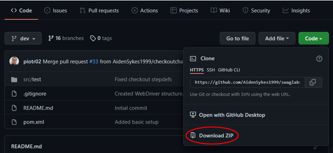
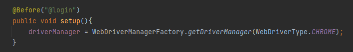

# Swag Lab Testing Project

> Contributors:
>
> • Roberto Lovece - Junior Java SDET Consultant | [Portfolio](https://robertolovece.github.io/Portfolio-Website/) | [GitHub](https://github.com/RobertoLovece) | [LinkedIn](https://www.linkedin.com/in/roberto-lovece-20abb121a/) |
>
> • Antony Ademefun - Junior Java SDET Consultant | [GitHub](https://github.com/antonya3) | [LinkedIn](https://www.linkedin.com/in/antony-ademefun/) |
>
> • Mihai Udrea - Junior Java SDET Consultant | [GitHub](https://github.com/udreamihai) | [LinkedIn](https://www.linkedin.com/in/mihai-udrea-307885b7/) |
>
> • Aiden Sykes - Junior Java SDET Consultant | [GitHub](https://github.com/AidenSykes1999) | [LinkedIn](https://www.linkedin.com/in/aiden-sykes/) |
>
> • Piotr Sulek - Junior Java SDET Consultant | [GitHub](https://github.com/piotr02) | [LinkedIn](https://www.linkedin.com/in/piotr-sulek/) |
>
> • Harry Lewis - Junior Java SDET Consultant | [GitHub](https://github.com/harrylewis955) |
> 
> • Brandon Johnson - Junior Java SDET Consultant | [GitHub](https://github.com/brandonj987) |
>
>

## **Table Of Contents**
* [**Overview**](#overview)
* [**Software & Dependencies**](#software-&-dependencies)
  - [IntelliJ IDEA 2021.3.1 (Ultimate Edition)](#intellij-idea-2021.3.1-(ultimate-edition))
  - [JDK 17.0.2](#jdk-17.0.2)
  - [Apache Maven](#apache-maven)
  - [JUnit Jupiter API 5.8.2](#junit-jupiter-api)
  - [Cucumber JVM: Java 7.2.3](#cucumber-jvm:-java-7.2.3)
  - [Cucumber JVM: JUnit 7.2.3](#cucumber-jvm:-junit-7.2.3)
* [**How To Use**](#how-to-use)
  - [Downloading and opening the project](#downloading-and-opening-the-project)
  - [Setting up the web drivers](#setting-up-the-web-drivers)
  - [Running the tests](#running-the-tests)
* [**Future Work**](#future-work)

### Overview
This is a testing framework for the [Swag Labs](https://www.saucedemo.com/)
website, developed as part of the [Sparta Global](https://www.spartaglobal.com/) 
training. The purpose of this project is to allow the website to be
tested easily by providing modular methods that can be used to check
different web elements. The project includes Cucumber and JUnit tests,
but further tests can be created based on the framework.

### Software & Dependencies
* [IntelliJ IDEA 2021.3.1 (Ultimate Edition)](https://www.jetbrains.com/idea/download/#section=windows)
* [JDK 17.0.2](https://jdk.java.net/17/)
* Apache Maven
    * _**Note:** This dependency can be imported using IntelliJ._
    * _Go to **"File" > "New Project"** and then selecting **"Maven"** as the project structure._
* [JUnit Jupiter API 5.8.2](https://mvnrepository.com/artifact/org.junit.jupiter/junit-jupiter-api/5.8.2)
  * _**Note:** This dependency can be imported within Intellij using Apache Maven and IntelliJ's built-in dependency generator._
  * Alternatively you can open the Maven **"pom.xml"** file and paste in the following code within the **"dependencies"** section of the file:
```xml
    <dependency>
        <groupId>org.junit.jupiter</groupId>
        <artifactId>junit-jupiter</artifactId>
        <version>5.8.2</version>
    </dependency>
```
* [Cucumber JVM: Java 7.2.3](https://mvnrepository.com/artifact/io.cucumber/cucumber-java/7.2.3)
  * _**Note:** This dependency can be imported within Intellij using Apache Maven and IntelliJ's built-in dependency generator._
  * Alternatively you can open the Maven **"pom.xml"** file and paste in the following code within the **"dependencies"** section of the file:
```xml
    <dependency>
        <groupId>io.cucumber</groupId>
        <artifactId>cucumber-java</artifactId>
        <version>7.2.3</version>
    </dependency> 
```
* [Cucumber JVM: JUnit 7.2.3](https://mvnrepository.com/artifact/io.cucumber/cucumber-java/7.2.3)
  * _**Note:** This dependency can be imported within Intellij using Apache Maven and IntelliJ's built-in dependency generator._
  * Alternatively you can open the Maven **"pom.xml"** file and paste in the following code within the **"dependencies"** section of the file:
```xml
    <dependency>
        <groupId>io.cucumber</groupId>
        <artifactId>cucumber-junit</artifactId>
        <version>7.2.3</version>
    </dependency>
```

### How To Use

#### Downloading and opening the project
1. Download the project by clicking Code > Download ZIP as shown below

2. Right-click on the downloaded file and press "Extract all"
3. Open IntelliJ Community or Ultimate Edition and navigate to File > Open
4. Select the unzipped project folder and press Ok

#### Setting up the web drivers
1. Download the web driver for the browser you wish to use.
Available browsers are: Chrome, Firefox, Opera, and Edge.
Make sure the version of the driver matches the version
of the browser you have installed.
2. Place the web driver in src/test/resources/drivers
3. Create a "WebDriver.properties" file in src/test/resources
4. Inside the file, specify the path to the web driver/s as shown below, do not include file extensions (e.g. .exe)
```properties
ChromeDriverPath= src/test/resources/drivers/chromedriver
FirefoxDriverPath= src/test/resources/drivers/geckodriver
OperaDriverPath= src/test/resources/drivers/operadriver
EdgeDriverPath= src/test/resources/drivers/msedgedriver
```
5. Inside stepDef files, specify which browser you wish to use, as shown below.
You only need to change the word "CHROME". Available options are
"CHROME", "OPERA", "EDGE", "FIREFOX".


#### Running the tests
You can run each .feature file separately. Feature files
are found in src/test/resources/features.
You can also run tests by using the TestRunner found in
src/test/java/com/sparta/swaglabtesting.
You can use tags to specify which tests to run or leave the tag
empty to run them all.

### Future Work
Possible extensions of the projects could include:
- adding support for more browsers
- adding support for MAC OS
